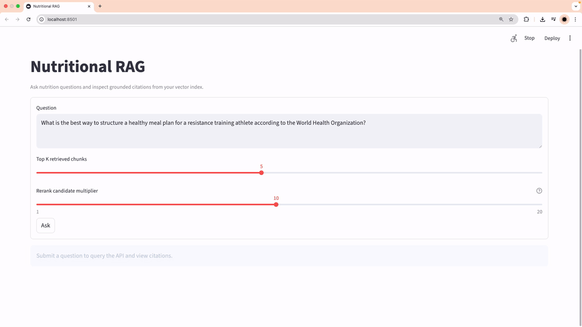
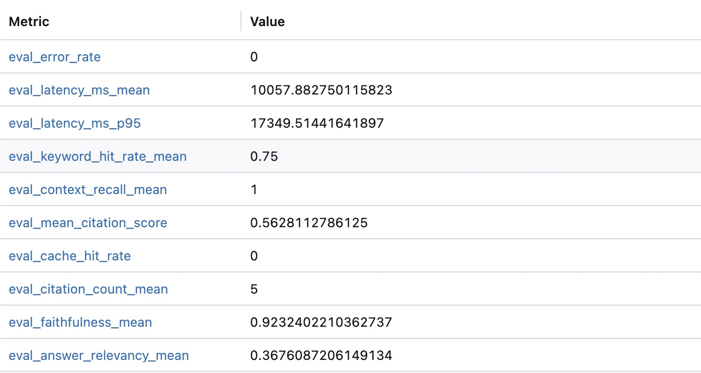
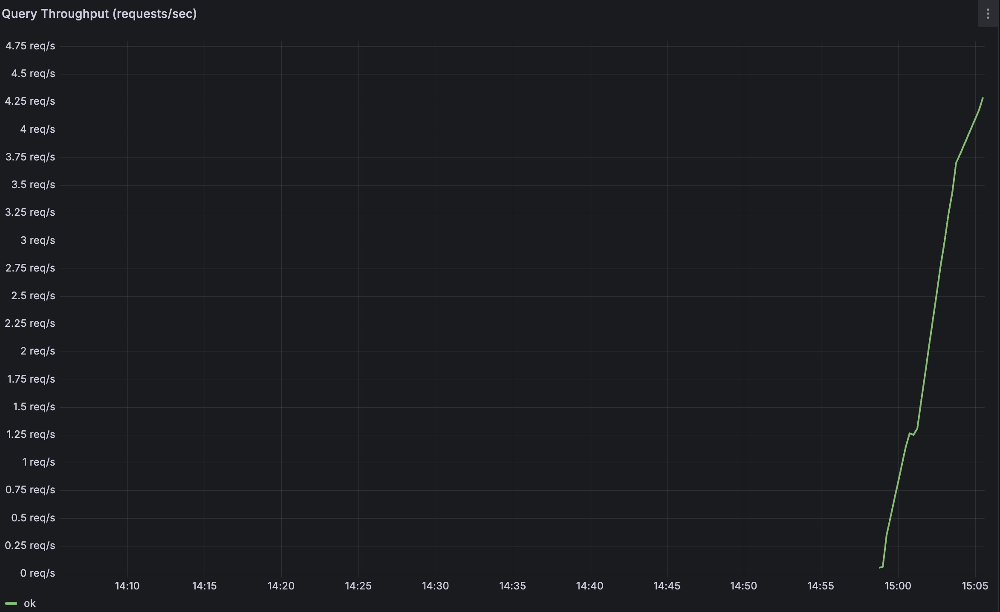
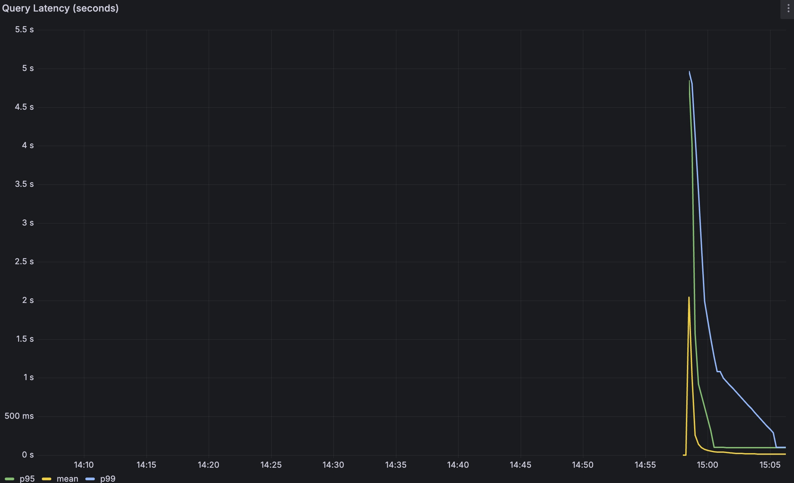
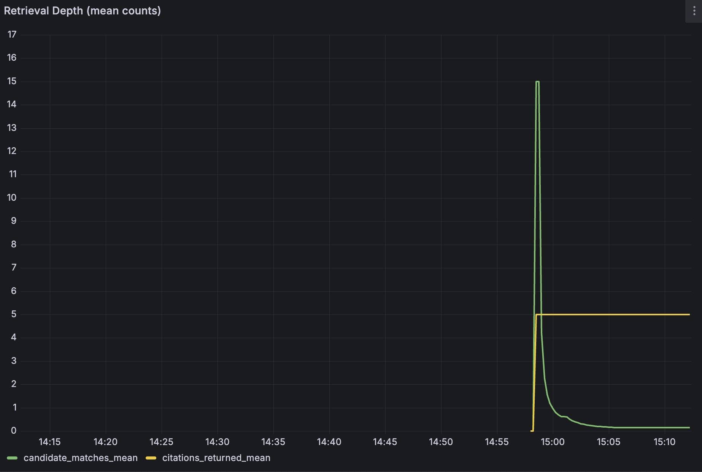

# Nutritional RAG

Initial repository scaffold for a nutritional Retrieval-Augmented Generation (RAG) system built around this stack:

- LangChain for implementing ETL loaders (PDF, PubMed, YouTube)
- Pinecone for vector retrieval
- OpenAI embeddings with `text-embedding-3-small`
- GPT-4 for generation
- MLflow for experiment tracking
- FastAPI for serving
- Redis for caching
- Prometheus and Grafana for metrics and dashboards
- Streamlit for the demo UI
- Docker Compose for local orchestration
- GitHub Actions for CI and container publishing

## Demo

[](https://youtu.be/et7RKYLQvMQ)

Preview the Streamlit experience above, or watch the full demo on [YouTube](https://youtu.be/et7RKYLQvMQ).

## Repo Layout

```text
.
├── .github/workflows/
├── apps/
│   ├── api/
│   └── ui/
├── data/
│   ├── eval/
│   ├── processed/
│   └── raw/
├── ml/
│   └── reranker/
├── notebooks/
├── src/
│   └── nutritional_rag/
└── tests/
```

## What Is Included

- Python project metadata in `pyproject.toml`
- Minimal FastAPI app with health and readiness endpoints
- Minimal Streamlit landing page for the demo UI
- Starter ETL extract pipeline modules for CSV, JSON, HTML, text, PDF, PubMed, and YouTube sources
- Make targets for local development
- GitHub Actions CI workflow for linting and tests
- GitHub Actions publish workflow for API and UI images to GHCR

## Quick Start

```bash
python -m venv .venv
source .venv/bin/activate
pip install --upgrade pip
pip install -e ".[api,ui,dev]"
cp .env.example .env
make test
make run-api
```

In a second shell:

```bash
source .venv/bin/activate
make run-ui
```

Run the starter extract pipeline:

```bash
source .venv/bin/activate
export PYTHONPATH=src
make run-etl-extract
```

This writes normalized raw documents to `data/raw/extracted_documents.ndjson`.

For real local sources (recommended):

```bash
cp etl/sources.bodybuilding.example.json etl/sources.bodybuilding.local.json
# edit the location path in the local file
python -m nutritional_rag.etl.cli --stage extract --config etl/sources.bodybuilding.local.json
```

For PubMed extraction via LangChain:

```bash
source .venv/bin/activate
pip install -e ".[etl,dev]"
export PYTHONPATH=src
python -m nutritional_rag.etl.cli --stage extract --config etl/sources.pubmed.example.json
```

For YouTube transcript extraction via LangChain:

```bash
source .venv/bin/activate
pip install -e ".[etl,dev]"
export PYTHONPATH=src
python -m nutritional_rag.etl.cli --stage extract --config etl/sources.youtube.example.json
```

For Harvard Nutrition Source news extraction via LangChain:

```bash
source .venv/bin/activate
pip install -e ".[etl,dev]"
export PYTHONPATH=src
python -m nutritional_rag.etl.cli --stage extract --config etl/sources.harvard_news.example.json
```

If the base news page is intermittently bot-blocked, prefer the site feed URL
(`.../nutrition-news/feed/`) in your source config.

Note: for reliable extraction across videos, prefer `"add_video_info": false`
in source metadata (transcript-only mode).

For broader PubMed coverage without hand-writing many source objects, use the
topic-batched PubMed workflow:

```bash
source .venv/bin/activate
pip install -e ".[etl,dev]"
export PYTHONPATH=src
python scripts/batch_pubmed_topics.py --config etl/pubmed_topics.example.json
```

This script:

- loops over multiple PubMed topic queries
- sleeps between topics to reduce rate-limit pressure
- deduplicates results by PubMed UID when available
- runs transform and chunk stages automatically
- can load the final chunk set into Pinecone

Run the transform stage:

```bash
source .venv/bin/activate
export PYTHONPATH=src
make run-etl-transform
```

This writes transformed records to `data/processed/transformed_documents.ndjson`.
By default, this stage applies nutrition-only filtering with keyword/rule scoring.

Run the chunk stage:

```bash
source .venv/bin/activate
export PYTHONPATH=src
make run-etl-chunk
```

This writes chunked records to `data/processed/chunks.ndjson`.

Run the load stage (OpenAI embeddings + Pinecone upsert):

```bash
source .venv/bin/activate
export PYTHONPATH=src
# Uses OPENAI_API_KEY, PINECONE_API_KEY, PINECONE_INDEX from .env
make run-etl-load
```

Use dry-run for local validation without external API calls:

```bash
python -m nutritional_rag.etl.cli --stage load --input data/processed/chunks.ndjson --dry-run
```

Query your loaded knowledge base:

```bash
source .venv/bin/activate
export PYTHONPATH=src
uvicorn apps.api.main:app --reload --host 0.0.0.0 --port 8000
```

Then in another shell:

```bash
curl -X POST http://localhost:8000/query \
	-H "Content-Type: application/json" \
	-d '{"question":"How are carbohydrates used in endurance exercise?","top_k":5}'
```

## MLflow Query Tracking and Evaluation

Query-time MLflow logging is supported directly in the API path (best-effort, non-blocking).

Environment variables:

- `MLFLOW_TRACKING_URI` (default: `http://localhost:5001`)
- `MLFLOW_EXPERIMENT_NAME` (default: `nutritional-rag-query`)
- `MLFLOW_LOG_QUERIES` (default: `true`)

Install ML dependencies if needed:

```bash
pip install -e ".[ml]"
```

Run a lightweight evaluation set against the live API and log aggregated metrics to MLflow:

```bash
python scripts/evaluate_rag.py \
	--api-base-url http://127.0.0.1:8001 \
	--eval-set data/eval/nutrition_eval_set.ndjson \
  --rerank-candidate-multiplier 3 \
  --skip-generation \
  --mlflow-tracking-uri http://localhost:5001 \
  --mlflow-experiment nutritional-rag-eval
```

Or use:

```bash
make run-eval
```

Run a parameter sweep and log one MLflow run per configuration:

```bash
python scripts/sweep_eval.py \
  --api-base-url http://127.0.0.1:8001 \
  --eval-set data/eval/nutrition_eval_set.ndjson \
  --top-k-values 3,5,8 \
  --rerank-candidate-multipliers 1,2,3 \
  --mlflow-tracking-uri http://localhost:5001 \
  --mlflow-experiment nutritional-rag-sweep
```

The sweep script runs in retrieval-only mode so you can compare retrieval latency and citation quality
without waiting for full answer generation on every configuration.

Or use:

```bash
make run-eval-sweep
```

### MLflow Evaluation Results

The evaluation script measures retrieval and generation quality across the eval set and logs all
metrics to MLflow. The current benchmark file includes 16 nutrition questions.

Results from a representative run against the live API:

| Metric | Value | Description |
|---|---|---|
| `eval_faithfulness_mean` | 0.926 | RAGAS: fraction of answer claims attributable to retrieved context |
| `eval_answer_relevancy_mean` | 0.978 | RAGAS: semantic alignment between answer and original question |
| `eval_context_recall_mean` | 1.000 | RAGAS: fraction of reference-answer sentences grounded in retrieved context |
| `eval_keyword_hit_rate_mean` | 1.000 | At least one expected keyword found in every answer |
| `eval_mean_citation_score` | 0.563 | Mean Pinecone similarity score of the top-cited chunk |
| `eval_latency_ms_mean` | 6987 ms | End-to-end generation latency per query (p50) |
| `eval_error_rate` | 0.000 | Zero failed API calls across all eval queries |



> Save the MLflow experiment screenshot as `docs/screenshots/mlflow_eval_metrics.png` to display it above.
>
> Note: `eval_latency_ms_p95` in MLflow is intentional. It summarizes tail latency across the evaluation sample,
> while Prometheus/Grafana track the same behavior continuously over live traffic windows.

Useful endpoints:

- API: `http://localhost:8000`
- API metrics: `http://localhost:8000/metrics`
- UI: `http://localhost:8501`
- Redis: `localhost:6379`
- MLflow: `http://localhost:5001`
- Prometheus: `http://localhost:9090`
- Grafana: `http://localhost:3000`

Provisioned Grafana dashboard:

- Folder: `Nutritional RAG`
- Dashboard: `Nutritional RAG - Query Overview`

Grafana default login (from compose env defaults):

- Username: `admin`
- Password: `admin`

If login fails because a prior password was persisted in Docker volume state,
reset Grafana state with:

```bash
docker compose down -v
docker compose up --build -d
```

If you add or change dashboard provisioning files and do not see updates immediately:

```bash
docker compose restart grafana prometheus api
```

## Grafana Demo and Screenshot Workflow

1. Start the stack:

```bash
docker compose up --build -d
```

2. Generate dashboard-friendly traffic:

```bash
make run-demo-traffic
```

This script does two things:

- sustained request traffic so throughput and latency panels are populated
- short concurrent bursts so In-Flight Queries spikes are visible during capture

3. In Grafana (`http://localhost:3000`), set time range to **Last 1 hour**.

4. Capture these panels and save them to `docs/screenshots/` using the filenames below:

| Panel | Save as |
|---|---|
| Query Throughput (requests/sec) | `grafana_query_throughput.png` |
| Query Latency with p95 and p99 | `grafana_query_latency.jpg` |
| Retrieval Depth (mean counts) | `grafana_retrieval_depth.png` |

Once saved, they display below:

### Query Throughput



### Query Latency (p50 / p95 / p99)



### Retrieval Depth



Tip: In-Flight Queries is an instant gauge, so it is normally 0 between bursts.
Capture while concurrent traffic is running if you want a non-zero screenshot.

### Dashboard KPI Snapshot (From Grafana)

- Query latency p95 (30m window)
- Error rate (30m window)

## Prometheus Metrics (Query Path)

The API exports these custom metrics at `/metrics`:

- `nutritional_rag_query_requests_total{status,generate_answer}`
- `nutritional_rag_query_errors_total{error_type}`
- `nutritional_rag_query_in_flight`
- `nutritional_rag_query_duration_seconds` (histogram)
- `nutritional_rag_query_top_k` (histogram)
- `nutritional_rag_query_rerank_candidate_multiplier` (histogram)
- `nutritional_rag_query_candidate_matches` (histogram)
- `nutritional_rag_query_citations_returned` (histogram)

Stop services:

```bash
docker compose down
```

## Real Source Testing

You can test extraction against real local data sources, including PDF books.

Example PDF source config:

- `etl/sources.bodybuilding.example.json` (template)

Use your local-only config (ignored by git):

```bash
cp etl/sources.bodybuilding.example.json etl/sources.bodybuilding.local.json
# edit location to your absolute local PDF path

source .venv/bin/activate
pip install -e ".[dev]"
export PYTHONPATH=src
python -m nutritional_rag.etl.cli --stage extract --config etl/sources.bodybuilding.local.json
python -m nutritional_rag.etl.cli --stage transform --input data/raw/extracted_documents.ndjson
```

For PDFs, extraction emits one document per page with page metadata.
For PubMed, extraction uses LangChain `PubMedLoader` and emits one document per returned abstract.
For YouTube, extraction uses LangChain `YoutubeLoader` and emits transcript documents with video metadata.

## GitHub Actions

- `ci.yml` runs Ruff and pytest on pushes and pull requests
- `docker-publish.yml` builds and publishes the API and UI images to GHCR on pushes to `main`, version tags, and manual dispatch

## Next Build Steps

1. Expand source adapters and add production-grade extraction quality checks.
2. Add transformation and chunking pipelines for nutritional records.
3. Wire Pinecone indexing and retrieval through LangChain.
4. Add LangChain-based query orchestration for retrieval and generation flow control.
5. Add sentence-transformers and PyTorch reranking in the query path.
6. Add the reranker training and serving path under `ml/reranker`.
7. Add MLflow Model Registry workflow for model versioning and stage transitions.
8. Wire retrieval, reranking, and answer generation into the API and UI.
